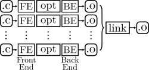
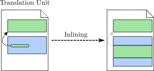

# The inline and static keywords and the inlining optimisation
<!-- ## Why inline does not actually inline a function? -->

>---
> 
>### TL;DR
> 
> The `inline` keyword does **not** force the function to always be actually inlined.
> 
>#### Quick Practical Tips:
>* Use a header file with declarations and have these functions defined only once in an  implementation file.
>* If distinct functions **must** have the same name in different implementation files, use the `static` keyword in each local definition.
>* Do not use the `inline` keyword.
>* Use link-time optimisation (`-flto` flag).
> 
>---

Traditionally, compilers operator on a single translation unit at a time, i.e.,
a single source file and its expanded headers.
Each translation unit is compiled into an object file, and then the linker 
is responsible for combining multiple object files into a single binary.
Optimisations are applied within each translation unit during the compilation.
See the figure below:



Most of the classic optimisations are applied within the scope of a single function.
This optimisations are not affected by changes in the translation unit external
to the function itself. 
However, some optimisations are inter-procedural, such as function inlining.
These inter-procedural optimisations are heavily affected by how many functions are available in a single translation unit.
Ideally, all functions would be in a single translation unit, as we will see later when talking about link-time optimisation.
In general, compiler optimisations benefit from having larger context, simply because more code offers more opportunities for improvement or more information that the compiler can use to prove certain properties of the code,
allowing the compiler to transform the code without changing its semantics.

The figure below illustrates how function inlining works.
Each coloured box represents a function and the black arrow a function call.
When applying inline to a particular call-site, the call is replaced by a copy of the function body with the formal parameters being replaced by the corresponding actual arguments.
The original callee function continues to exists unaltered.
When inlining, the compiler must have access simultaneously to the both the
caller function and the function being called (i.e., the callee).
That is, the inliner benefits greatly from having the code of more functions at its disposal.

 



talk about inlining, optimisation per compilation unit and how the inline keyword addresses this problem.

talk about hand-optimizing programs.

specialist programmer vs average programmer.

https://www.quora.com/Are-compilers-really-better-than-human-at-code-optimisation


then talk about link-time optimisation.


practi

File: `user1.c`

```C
#include <stdio.h>

inline void foo() {
  printf("This is the foo function.\n");
}

int fooUser1() {
  foo();
  return 1;
}

```

File: `user2.c`
```C
#include <stdio.h>

inline void foo() {
  printf("This is the foo function.\n");
}

int fooUser2() {
  foo();
  foo();
  return 2;
}

```

File: `main.c`
```C
#include <stdio.h>

void foo() {
  printf("This is the foo function.\n");
}

int fooUser1();
int fooUser2();

int main() {
  fooUser1();
  fooUser2();
  return 0;
}

```
>#### Opinion:
>* The `static` keyword should have been called `internal`.
>* The `inline` keyword was a poorly designed feature with a bad name, though it was driven by practical limitations at the time.


## LLVM Internals


### Clang in C mode

`inline`

`inlinehint` and `available_externally` linkage.

`inline static`

`inlinehint` and `internal` linkage.

`static`

only `internal` linkage.


### Clang in C++ mode

`inline`

`inlinehint` and `linkonce_odr` linkage.

`static`

`inlinehint` and `internal` linkage.
