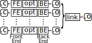
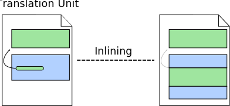
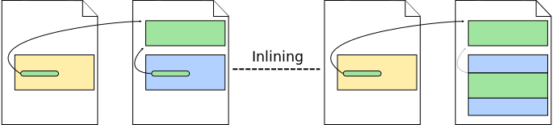
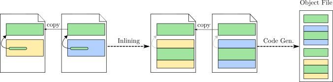
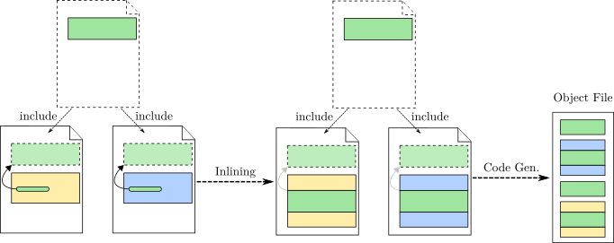

# The inline and static keywords and the inlining optimisation
<!-- ## Why inline does not actually inline a function? -->

>---
> 
>### TL;DR
> 
> The `inline` keyword does **not** guarantee the function will actually be inlined.
> 
>#### Quick Practical Tips:
>* Use a header file with declarations and have these functions defined only once in an  implementation file.
>* If distinct functions **must** have the same name in different implementation files, use the `static` keyword in each local definition.
>* Do not use the `inline` keyword.
>* Use link-time optimisation (`-flto` flag).
> 
>---

Traditionally, compilers operate on a single translation unit at a time, i.e.,
a single source file and its expanded headers.
Each translation unit is compiled into an object file, and then the linker 
is responsible for combining multiple object files into a single binary.
Optimisations are then applied within each translation unit during compilation.
See the figure below:



Most of the classic optimisations are applied within the scope of a single function.
These optimisations are not affected by changes in the translation unit external
to the function itself. 
However, some optimisations are inter-procedural, such as function inlining.
These inter-procedural optimisations are heavily affected by how many functions are available in a single translation unit.
Ideally, all functions would be in a single translation unit, as we will see later when talking about link-time optimisation.
In general, compiler optimisations benefit from having larger context, simply because more code offers more opportunities for improvement or more information that the compiler can use to prove certain properties of the code,
allowing the compiler to transform the code without changing its semantics.

The figure below illustrates how function inlining works.
Each coloured box represents a function and the black arrow a function call.
When applying inline to a particular call-site, the call is replaced by a copy of the function body with the formal parameters being replaced by the corresponding actual arguments.
The original callee function continues to exists unaltered.
When inlining, the compiler must have access simultaneously to the both the
caller function and the function being called (i.e., the callee).
That is, the inliner benefits greatly from having the code of more functions at its disposal.



However, in most real programs, a function defined in one implementation file
(translation unit) will be used in several other files.
The figure below illustrates one such scenario.
Because optimization is applied to one compilation unit at a time, the compiler
is only able to inline a function call when the callee function is present in
the same translation unit.
In the remaining cases, the compiler is unable to inline a function call as it
does not have access to the definition of the function being called as it is
defined in a different translation unit.



A programmer can manually resolve that by copying the function definition to
multiple implementation files where it is used.
However, the compiler would normally raise a compilation error due to *multiple definitions*.
Consider the example bellow:

`file1.c`
```C
void foo() {}
void bar() { foo(); }
```
`file2.c`
```C
void foo() {}
void baz() { foo(); }
```
`main.c`
```C
int main() { return 0; }
```
If we compile these files with the command `clang *.c -o main`, we get the following error message:
```
/tmp/file2-d2d43e.o: In function `foo':
file2.c:(.text+0x0): multiple definition of `foo'
/tmp/file1-c68965.o:file1.c:(.text+0x0): first defined here
```
This error is detected during link time.
Once each object file has been created by the back-end, the linker is responsible
for combining all of them into a single executable.
During this process, the linker identifies that there are multiple definitions
of an *external symbol* a name conflict between
read these
files and identifies that a given symbol is defined in more than one of the
object files being linked **[TODO: More details]**.
One way the programmer can avoid that is by defining the copies of the function as
having a local linkage by using the `static` keyword.

`file1.c`
```C
void foo() {}
void bar() { foo(); }
```
`file2.c`
```C
static void foo() {}
void baz() { foo(); }
```
`main.c`
```C
int main() { return 0; }
```








The inline specifier is a hint to the compiler that it should attempt to generate code for a call of fac()
inline rather than laying down the code for the function once and then calling through the usual
function call mechanism.

To make inlining possible in the absence of unusually clever compilation and linking facilities,
the definition – and not just the declaration – of an inline function must be in scope (§15.2). An
inline specifier does not affect the semantics of a function. In particular, an inline function still has
a unique address, and so do static variables (§12.1.8) of an inline function.
If an inline function is defined in more than one translation unit (e.g., typically because it was
defined in a header; §15.2.2), its definition in the different translation units must be identical.


An inline function (§12.1.3, §16.2.8) must be defined identically in every translation unit in
which it is used (§15.2.3). Consequently, the following example isn’t just bad taste; it is illegal:
// file1.cpp:
inline int f(int i) { return i; }
// file2.cpp:
inline int f(int i) { return i+1; }

We keep inline function definitions consistent by using header files.


talk about inlining, optimisation per compilation unit and how the inline keyword addresses this problem.

talk about hand-optimizing programs.

specialist programmer vs average programmer.

https://www.quora.com/Are-compilers-really-better-than-human-at-code-optimisation


then talk about link-time optimisation.


practi

File: `user1.c`

```C
#include <stdio.h>

inline void foo() {
  printf("This is the foo function.\n");
}

int fooUser1() {
  foo();
  return 1;
}

```

File: `user2.c`
```C
#include <stdio.h>

inline void foo() {
  printf("This is the foo function.\n");
}

int fooUser2() {
  foo();
  foo();
  return 2;
}

```

File: `main.c`
```C
#include <stdio.h>

void foo() {
  printf("This is the foo function.\n");
}

int fooUser1();
int fooUser2();

int main() {
  fooUser1();
  fooUser2();
  return 0;
}

```
>#### Opinion:
>* The `static` keyword should have been called `internal`.
>* The `inline` keyword was a poorly designed feature with a bad name, though it was driven by practical limitations at the time.


## LLVM Internals


### Clang in C mode

`inline`

`inlinehint` and `available_externally` linkage.

`inline static`

`inlinehint` and `internal` linkage.

`static`

only `internal` linkage.


### Clang in C++ mode

`inline`

`inlinehint` and `linkonce_odr` linkage.

`static`

`inlinehint` and `internal` linkage.
